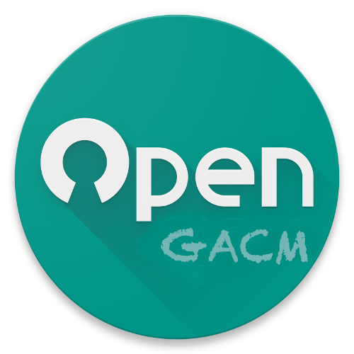
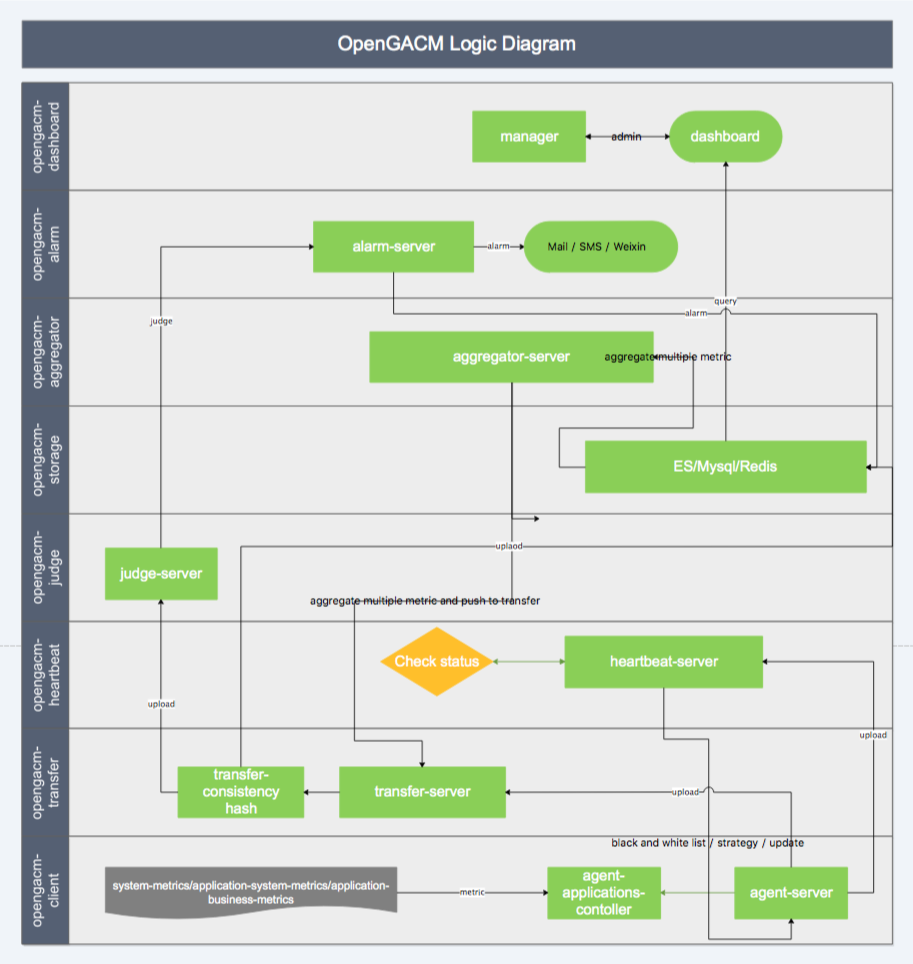

# opengacm

OpenGACM is a Distributed and High-Performance Golang application Managing and Monitoring System.

## Modules

- [opengacm-client](https://github.com/wgliang/opengacm/modules/client) - opengacm-client is a client agent that can manage local go applications,such as building applications, opening, shutting down and restarting operations; and you can also use gacm-client to diagnose running Go applications. In addition, as an important part of the opengacm project, opengacm-client is a machine-level proxy unit that will assume data acquisition, data reporting, application remote management, and application deployment.
- opengacm-transfer 
- opengacm-heaetbeats
- opengacm-judge
- opengacm-aggregator
- opengacm-alarm
- opengacm-sotrage
- opengacm-dashboard

## Architecture

## Credits

Inspired by [gops](https://github.com/google/gops),[apm](https://github.com/topfreegames/apm) and [moby](https://github.com/moby/moby).

